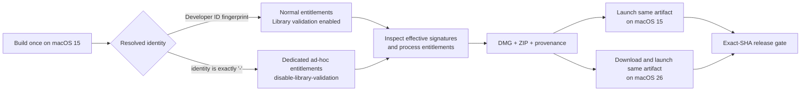

# Issue #59 macOS 26 Apple Silicon Launch Crash Implementation Plan

> **For agentic workers:** REQUIRED SUB-SKILL: Use `executing-plans` to implement this plan task-by-task, `test-driven-development` for every behavior change, `systematic-debugging` if the macOS 26 reproduction differs from the evidence below, and `verification-before-completion` before any completion claim. Every executable step uses checkbox (`- [ ]`) syntax for tracking.

**Status:** Approved for implementation and release by the user on 2026-09-13. The checkboxes below preserve the original execution and acceptance specification; completion still requires terminal evidence for the exact hosted CI run, merged main SHA, immutable `v4.62.2` tag, release assets, and Issue #59 closure.

**Execution update (CI run `34744910612`):** The first fix-head run produced and launched all macOS 15 artifacts, but exposed two test-harness defects before release. The current hosted `macos-26` arm64 runner launched the exact public v4.62.1 DMG instead of reproducing the reporter's `25G83` dyld abort, so old-runtime failure is not a portable CI invariant. The gate now proves the old defect deterministically by staging the exact hash-pinned v4.62.1 DMG and ZIP without mutation and requiring the effective signing-policy inspector to reject both because their hardened Electron processes lack `disable-library-validation`; the old runtime launch result is retained as a non-gating observation. The same run also showed that target-native provenance sampled build byproducts instead of initial source cleanliness, so the orchestrator now snapshots Git status before any build/test step and forwards that value into release evidence. A new exact-head run must pass both fixes before integration continues.

**Execution update (CI run `34746365706`):** The deterministic v4.62.1 DMG/ZIP policy RED passed, the corrected arm64/x64 artifacts passed clean provenance and effective signing-policy verification, and both DMG and ZIP launched through LaunchServices on the current macOS 26 arm64 and Intel runners. The remaining packaged-smoke step failed before Electron started because the fresh compatibility checkout had installed dependencies but had not built the workspace packages imported by `desktop-dashboard.e2e.ts` (`@lnwjud/audit` and `@lnwjud/storage`). The compatibility job now builds only the five-package `@lnwjud/storage...` dependency graph before Playwright; this leaves the downloaded application artifacts untouched while making the test harness runnable. A new exact-head run must still pass the complete matrix before the change is eligible for PR or release.

**Execution update (CI run `34747745653`):** All native contracts, Windows verification, target-native macOS/Linux packages, v4.62.1 policy RED, corrected artifact provenance/policy, and macOS 26 x64 compatibility passed. On the exact reporter OS build (`26.6.2`, `25G83`) the arm64 DMG and ZIP also passed policy inspection and LaunchServices process survival, but the subsequent packaged E2E connected to a responsive Electron main process and observed no renderer page; later tests timed out waiting for a first window. The compatibility workflow had launched and forcibly terminated fresh DMG and ZIP instances after only three seconds immediately before E2E. That ordering can interrupt the pre-window Keychain-backed `safeStorage` initialization that Electron documents as asynchronous and has historically found timing-sensitive on macOS 26 arm64. The gate now stages both immutable artifacts without launching, runs the UI-level packaged E2E to completion first, and only then exercises DMG/ZIP LaunchServices startup. This preserves both acceptance boundaries without killing the first secure-storage startup before it creates a window. A new exact-head run must pass before PR creation.

**Goal:** Make the exact lnwjud macOS arm64 DMG/ZIP launch successfully on macOS 26 without weakening Developer ID builds, add an exact-artifact macOS 26 regression gate, and publish the correction only as a new patch release after the full release contract passes.

**Architecture:** Keep hardened runtime enabled. Select one of two explicit signing policies at package time: community ad-hoc builds receive a dedicated `disable-library-validation` entitlement on the Electron process entry points, while Developer ID builds retain library validation and require one non-empty Team ID across all bundled code. Inspect the effective signature and entitlements after signing, preserve the result in release evidence, then test the same artifact built on the minimum-build runner again on macOS 26 rather than rebuilding it there.

**Tech Stack:** Electron `43.4.1`, electron-builder `26.0.12`, `@electron/osx-sign` `1.3.1`, Node.js `24.x`, pnpm `10.15.0`, Vitest, Playwright, Bash, Apple `codesign`/`spctl`/`stapler`, GitHub Actions macOS 15 and macOS 26 runners.

## Global Constraints

- Preserve the user's current dirty `E:\lnwjud` working tree. At analysis time it is on `dev` at `4b26cd2`, seven commits behind `origin/dev`; implementation must start in an isolated clean worktree from the then-current approved baseline and must not reset, overwrite, or absorb unrelated changes.
- The affected public release is `v4.62.1`, source commit `e05e6f1f6b6425dd70771cf1fb9950d7d1a7bd26`. Reconfirm the tag, release assets, and hashes before implementation because release state can change.
- Do not change Electron, electron-builder, osx-sign, Node, pnpm, or the minimum supported macOS version in this hotfix. A dependency upgrade would make the signing diagnosis ambiguous and belongs in a separate plan.
- Keep `hardenedRuntime: true`. Do not use `hardenedRuntime: false`, `--deep --force` as a repair shortcut, disabled SIP, or post-install re-signing as the product fix.
- Never add `com.apple.security.cs.disable-library-validation` to the normal Developer ID entitlement files. It is permitted only in dedicated ad-hoc entitlement files selected when the resolved signing identity is exactly `-`.
- Do not claim that a static `codesign --verify` pass proves launch compatibility. The acceptance boundary is a real DMG/ZIP staged through normal macOS tools and launched through LaunchServices on the target OS.
- Do not treat `xattr -dr com.apple.quarantine` as a fix. Quarantine/Gatekeeper and dyld library validation are different layers; Issue #59 fails at dyld because mapped code is rejected.
- Do not replace the published `v4.62.1` assets in place. A corrected artifact must use a new immutable patch version and provenance.
- Keep all credentials out of source, logs, test fixtures, artifacts, and provenance. Developer ID/notarization tests run only in protected CI when credentials are deliberately configured.
- Use one authoritative watcher per exact GitHub Actions run ID. Do not infer success from a different run, a branch name, local tests, or an in-progress workflow.

---

## 1. Incident Summary

### User-visible failure

[GitHub Issue #59](https://github.com/engasnm111/lnwjud/issues/59) reports that `lnwjud 4.62.1` installed from the arm64 DMG exits immediately on a MacBook Air M1 running macOS Tahoe `26.6.2 (25G83)`.

The crash is not an application JavaScript exception:

- Process type: native ARM64.
- Termination: `EXC_CRASH (SIGABRT)`.
- Namespace: `DYLD`, code `1`.
- Rejected image: `Electron Framework.framework/Versions/A/Electron Framework`.
- Loader reason: the mapping process and mapped framework have different Team IDs.
- The main app's crash metadata has an empty `codeSigningTeamID`.
- The process dies before Electron main-process code or the renderer can start.

The message says “Library missing,” but the report shows that the framework path is found. dyld refuses to map the file because of code-signing/library-validation policy.

### Severity

**Release blocker for affected macOS artifacts.** The supported desktop cannot reach first launch. There is no evidence of data loss, credential exposure, or a JavaScript/runtime regression; the failure is entirely before application initialization.

---

## 2. Evidence Confirmed During Analysis

| Evidence | Confirmed result | Consequence |
| --- | --- | --- |
| Issue report | M1, arm64 DMG, macOS `26.6.2 (25G83)`, dyld Team-ID rejection | Diagnose packaging/signing before application code |
| Public asset | `lnwjud-4.62.1-arm64.dmg`, SHA-256 `d9cf74be1711a123fde49fc070c6fe055bf2c65bf6345395d4c8fa3816bed12c` | Use this exact immutable artifact for the policy RED and runtime observation |
| Public ZIP | `lnwjud-4.62.1-arm64.zip`, SHA-256 `cf982b59a42c0ee6f91186212a03a683634e6c14675a718ddbdbf6fe1ba00db8` | Validate both distribution formats |
| Release provenance | CI run `34732348722`, source commit `e05e6f1...`, `signingCredentialConfigured: false`, signing mode `ad-hoc` | The public macOS release is not Developer ID signed |
| Builder config | `apps/desktop/electron-builder.yml` enables hardened runtime and uses `scripts/sign-macos-runtime.mjs` | Preserve hardened runtime and fix the signing policy |
| Entitlements | The current root and inherited plists do not contain `com.apple.security.cs.disable-library-validation` | An ad-hoc process has no explicit exception from library validation |
| Custom signer | v4.62.1 already runs osx-sign before and after runtime-manifest rewrites and verifies that the app/framework appear ad-hoc | Repeating the same normalization is not a sufficient fix |
| Static verifier | `scripts/verify-macos-release.sh` checks signature integrity and whether nested code is ad-hoc or has the same Team ID | It does not inspect effective entitlements or prove macOS 26 launch behavior |
| CI runner | arm64 and x64 packages were built, verified, and launched on macOS 15 runners | CI proved macOS 15 behavior only |
| Exact CI logs | arm64 ran on macOS `15.7.9 (24G830)` and passed layout, nested ad-hoc signature, LaunchServices, and ten packaged E2E tests | A green v4.62.1 CI run does not contradict the macOS 26 crash |
| Available runner | GitHub currently exposes `macos-26` and `macos-26-intel`; the live OS build is captured in every compatibility artifact | The runner label proves current macOS 26 compatibility, but must not be presented as the reporter's exact `25G83` build unless `sw_vers` confirms it |
| Documentation | README/FULL_README say the macOS 26 launch problem is fixed; install/release docs describe stronger production signing than the published ad-hoc artifact actually has | Correct the support/release claims together with the code |

The relevant signing, entitlement, verification, and workflow files are unchanged between the current local HEAD and the `v4.62.1` source commit, so the local inspection is representative of the released implementation. The local checkout is still not a valid release-validation baseline because its version and branch state differ.

---

## 3. Root-Cause Analysis

### Confirmed root-cause boundary

The failure boundary is **macOS code signing and dyld library validation**, not Electron application logic. The exact released app uses:

1. hardened runtime;
2. an ad-hoc outer signature because no Apple signing credential was configured;
3. nested Electron code that the custom hook attempts to normalize to ad-hoc;
4. no entitlement that disables library validation for the Electron host processes; and
5. launch validation only on macOS 15.

An ad-hoc signature has no Apple Developer Team ID. Checking that two files both say `Signature=adhoc` proves their signature mode and integrity, but it does **not** create a shared Team ID and therefore does not prove the library-validation relationship that dyld enforces. The empty main-app Team ID in the crash report is consistent with this state.

Apple documents two valid remedies for a library-validation Team-ID mismatch: sign the process and its bundled libraries with the same real team, or grant the loading process `com.apple.security.cs.disable-library-validation`. Apple prefers same-team signing because disabling library validation reduces protection. electron-builder's macOS signing documentation separately calls out the ad-hoc plus hardened-runtime case and the same entitlement workaround.

### Ranked, falsifiable hypotheses

| ID | Confidence | Hypothesis | Prediction that confirms it | Result that falsifies or redirects it |
| --- | --- | --- | --- | --- |
| H1 | Confirmed for the reporter's build | macOS library validation can reject the ad-hoc hardened-runtime Electron process even after all bundled code is re-signed ad-hoc | The reporter's dyld record identifies the exact Team-ID validation boundary; the exact v4.62.1 artifacts mechanically lack the required ad-hoc entitlement; a build differing only by the scoped entitlement launches | A reporter-side signing snapshot shows the entitlement was already present, or the corrected exact artifact fails with a different first cause |
| H2 | Medium | The two-pass signer or current verifier misses the effective code directory/entitlements used by dyld for the main executable or one framework slice | Detailed `codesign -dvvv`, designated requirements, CDHashes, and entitlements expose a mismatch not represented by the current `Signature=adhoc` check | Every relevant slice and process matches the expected snapshot, but launch still fails |
| H3 | Confirmed as a coverage gap | The macOS 15-only launch gate could not cover the reporter's newer dyld behavior | The release passed macOS 15 while the reporter's macOS `26.6.2 (25G83)` rejected it | A current hosted macOS 26 runner may still launch the old artifact; that narrows the reproducibility claim but does not erase the missing target-OS gate |
| H4 | Low | The reporter's downloaded/installed bytes differ from the official v4.62.1 artifact because of a stale download, partial copy, or third-party modification | Reporter hash/CDHashes differ; a clean install of the exact official hash launches | Hashes and signature snapshot match the official artifact and it still fails |

### Diagnostic decision result

CI run `34744910612` reached this decision point. The exact hash-pinned v4.62.1 DMG launched on the current hosted arm64 runner, so the plan does not claim a universal macOS 26 runtime reproduction. That result does not falsify the reporter's primary evidence: their `25G83` crash report identifies dyld Library Validation, and static inspection of the released signing policy shows the corresponding hardened Electron process has no Team ID and no `disable-library-validation` entitlement. The fix therefore remains evidence-driven rather than speculative, while the gate separates two assertions:

- **Deterministic regression:** the exact v4.62.1 DMG and ZIP must fail the new effective-policy inspector specifically for the missing ad-hoc entitlement.
- **Current-host compatibility:** the exact v4.62.2 DMG and ZIP must pass provenance/policy checks and launch through LaunchServices on the current arm64 and Intel macOS 26 runners.
- **Historical runtime observation:** whether the current runner launches v4.62.1 is recorded with `sw_vers` and logs, but is not allowed to fail or bless the corrected release.

---

## 4. Options Considered

| Option | Security | Speed | Decision |
| --- | --- | --- | --- |
| Sign every nested component with Developer ID and notarize | Strongest; preserves library validation | Requires Apple credentials and protected release setup | **Long-term production target** |
| For community ad-hoc builds only, keep hardened runtime and add `disable-library-validation` to Electron process entry points | Narrow, explicit reduction for an already ad-hoc artifact | Can unblock affected users without credentials | **Recommended patch-release hotfix** |
| Disable hardened runtime for ad-hoc builds | Broadly weakens runtime protection and diverges farther from production | Easy | **Rejected** |
| Repeat or deepen ad-hoc re-signing without an OS-level launch test | v4.62.1 already attempted this and still failed | Appears small but does not close the failure | **Rejected** |
| Tell users to remove quarantine, disable SIP, or manually re-sign `/Applications/lnwjud.app` | Mutates user installations, does not fix the release artifact, and can reduce security | Superficial workaround | **Rejected** |

### Chosen design



The distinction is made from the **resolved signer identity**, not from an environment name, branch, or event type. Certificate-required mode continues to fail closed if no certificate is resolved.

---

## 5. Planned File Map

| Action | Path | Responsibility |
| --- | --- | --- |
| Create | `apps/desktop/build/entitlements.mac.adhoc.plist` | Root Electron app entitlements for ad-hoc builds only |
| Create | `apps/desktop/build/entitlements.mac.adhoc.inherit.plist` | Helper-process entitlements for ad-hoc builds only |
| Modify | `apps/desktop/build/entitlements.mac.plist` | Keep the Developer ID/root policy explicit and free of library-validation bypass |
| Modify | `apps/desktop/build/entitlements.mac.inherit.plist` | Keep the Developer ID/helper policy explicit and free of library-validation bypass |
| Modify | `apps/desktop/electron-builder.yml` | Document that default entitlements are the certificate-safe baseline and the custom signer selects ad-hoc variants |
| Modify | `apps/desktop/scripts/sign-macos-runtime.mjs` | Select policy by resolved identity, keep two-pass sealing, and require post-sign policy inspection |
| Create | `apps/desktop/scripts/inspect-macos-signing-policy.mjs` | Inspect effective signatures/entitlements, validate ad-hoc versus certificate invariants, emit deterministic JSON evidence |
| Modify | `apps/desktop/scripts/capture-packaged-runtime-evidence.mjs` | Bind observed macOS signing-policy evidence to packaged runtime evidence and reject stale/inconsistent evidence |
| Modify | `apps/desktop/scripts/write-release-evidence.mjs` | Embed the observed signing policy in `PROVENANCE.json` |
| Modify | `apps/desktop/scripts/verify-release-evidence.mjs` | Require and validate the new macOS evidence schema in normal and artifact-only modes |
| Modify | `scripts/verify-macos-release.sh` | Fail closed for unsigned/mis-entitled artifacts and invoke the shared policy inspector on the extracted app |
| Modify | `scripts/stage-macos-smoke-app.sh` | Capture OS/signature/dyld diagnostics on a failed LaunchServices start without modifying the app |
| Modify | `tests/packaging/capture-packaged-runtime-evidence.test.ts` | Behavioral tests for policy selection, evidence freshness, and unchanged certificate mode |
| Create | `tests/packaging/macos-signing-policy.test.ts` | Table-driven parser/policy tests using injected codesign results |
| Modify | `tests/packaging/macos-trust-evidence.test.ts` | Contract tests for target-native verification and entitlement separation |
| Modify | `tests/release/platform-verification-orchestrator.test.ts` | Assert exact-artifact macOS 26 CI coverage |
| Modify | `tests/integration/cross-platform-release-scenarios.test.ts` | Record the macOS 15 build plus macOS 26 compatibility matrix |
| Modify | `.github/workflows/ci.yml` | Add downstream macOS 26 arm64/x64 jobs that reuse the macOS 15-built artifacts |
| Modify | `.github/RELEASE_CHECKLIST.md` | Require effective-policy evidence and macOS 26 exact-artifact launch before publication |
| Modify | `docs/INSTALL_MACOS.md` | Explain community ad-hoc versus Developer ID distribution truthfully |
| Modify | `docs/architecture/PLATFORM_SUPPORT.md` | Record tested OS/architecture boundaries and signing modes |
| Modify | `docs/development/RELEASE_PROCESS.md` | Correct runner versions and release gates |
| Modify | `README.md` and `FULL_README.md` | Replace the disproven v4.62.1 “macOS 26 fixed” claim with the verified patch behavior |
| Generated by version tool | root/app/package manifests, version constants, version tests, current-version docs | Synchronize the approved patch version consistently |

---

## 6. Detailed Implementation Tasks

### Task 0 — Establish a clean baseline and capture the exact policy RED

**Purpose:** Prove the defective effective signing policy on the exact released bytes, and separately record whether the current hosted image reproduces the runtime abort.

- [ ] Preserve the current dirty workspace and create an isolated implementation worktree from the current approved `origin/dev` only after user authorization. Confirm that it contains commit `e05e6f1f6b6425dd70771cf1fb9950d7d1a7bd26` and Issue #59's v4.62.1 signing changes.
- [ ] Record `git status --short --branch`, `git rev-parse HEAD`, `git merge-base --is-ancestor e05e6f1f6b6425dd70771cf1fb9950d7d1a7bd26 HEAD`, Node, pnpm, Electron, electron-builder, and osx-sign versions in the implementation notes.
- [ ] Add the macOS 26 compatibility job skeleton described in Task 5 without the entitlement fix, push the diagnostic branch only if authorized, resolve its exact numeric workflow run ID, and pass that ID to one authoritative `gh run watch` process using a 20-second interval and `--exit-status`.
- [ ] On `macos-26`, download `lnwjud-4.62.1-arm64.dmg` from the existing release, verify the SHA-256 above, stage it with `scripts/stage-macos-smoke-app.sh`, and launch through `open -n`.
- [ ] Capture `sw_vers`, `uname -m`, `codesign --display --verbose=4`, `codesign --display --requirements -`, and `codesign --display --entitlements :-` for the root main executable, Electron Framework binary, and each Electron helper executable.
- [ ] Capture dyld/unified-log output and the process exit/survival result. Do not remove quarantine, re-sign, or modify the staged bundle.
- [ ] Repeat the lightweight baseline on the v4.62.1 arm64 ZIP so the archive format is not confused with the signing defect.
- [ ] Save diagnostics as CI artifacts with the exact source SHA, release asset SHA, runner OS build, architecture, and run ID.

**Expected RED:** Both unmodified v4.62.1 formats are statically rejected because their hardened Electron process entries lack the ad-hoc library-validation exception. A matching dyld abort is stronger supplemental evidence when the live runner reproduces it, but is not assumed across runner image/build changes.

**Proposed commit boundary after the RED run is recorded:** `test(macos): reproduce issue 59 on macos 26`

### Task 1 — Add behavioral tests for the two signing policies

**Files:**

- Create `tests/packaging/macos-signing-policy.test.ts`.
- Modify `tests/packaging/capture-packaged-runtime-evidence.test.ts`.
- Modify `tests/packaging/macos-trust-evidence.test.ts`.

- [ ] Add a failing test that calls `signPackagedMacosRuntime` with identity `-` and asserts that both osx-sign passes receive the dedicated ad-hoc entitlement paths and `timestamp: 'none'`.
- [ ] Add a failing test that calls the same function with a 40-character certificate fingerprint and asserts that the existing standard root/inherited entitlement paths are unchanged.
- [ ] Add a failing test that makes certificate-required mode resolve to `-` and confirms it fails before any signing command.
- [ ] Add tests that read all four entitlement files and assert this exact separation:

| Entitlement file | `allow-jit` | network client | user-selected file read/write | `disable-library-validation` |
| --- | --- | --- | --- | --- |
| `entitlements.mac.plist` | yes | yes | yes | **absent** |
| `entitlements.mac.inherit.plist` | yes | yes | no | **absent** |
| `entitlements.mac.adhoc.plist` | yes | yes | yes | **true** |
| `entitlements.mac.adhoc.inherit.plist` | yes | yes | no | **true** |

- [ ] Add table-driven failing tests for the future inspector: valid ad-hoc, ad-hoc main missing the entitlement, ad-hoc helper missing it, certificate nested Team-ID mismatch, certificate build containing the bypass entitlement, unsigned code, missing hardened-runtime flag, and malformed `codesign` output.
- [ ] Make the tests inject command output; unit tests must not pretend to execute macOS tools on Windows or Linux.

**RED command:**

```powershell
corepack pnpm@10.15.0 exec vitest run tests/packaging/capture-packaged-runtime-evidence.test.ts tests/packaging/macos-signing-policy.test.ts tests/packaging/macos-trust-evidence.test.ts
```

**Expected RED:** Failures identify missing ad-hoc plist files, unchanged entitlement selection, and the absent inspector.

### Task 2 — Implement identity-driven ad-hoc entitlements

**Files:**

- Create `apps/desktop/build/entitlements.mac.adhoc.plist`.
- Create `apps/desktop/build/entitlements.mac.adhoc.inherit.plist`.
- Modify `apps/desktop/scripts/sign-macos-runtime.mjs`.
- Modify `apps/desktop/electron-builder.yml` comments only unless testing proves a functional config change is required.

- [ ] Create the two ad-hoc plist files with the exact capability matrix in Task 1. Do not add unrelated entitlements.
- [ ] Resolve both files from the signer's own module directory, not from the caller's current working directory.
- [ ] Wrap `configuration.optionsForFile` only when `identity === '-'`:
  - root `lnwjud.app` receives `entitlements.mac.adhoc.plist`;
  - nested helper apps/processes receive `entitlements.mac.adhoc.inherit.plist`;
  - existing hardened-runtime and all unrelated per-file options are preserved;
  - timestamp remains `none` for ad-hoc signing.
- [ ] Keep the existing inside-out osx-sign pass before runtime-manifest rewrites and the final sealing pass after those rewrites.
- [ ] Keep manually bundled runtime binaries (`rg`, tunnel client, native host) inside the same signature-mode verification. They do not load Electron Framework and therefore do not gain the library-validation entitlement merely because they are executable.
- [ ] Preserve the existing certificate fingerprint validation, secure timestamp, keychain routing, test requirement, and fail-closed `requireCertificate` behavior byte-for-byte where possible.
- [ ] Add a clear code comment explaining why “all code is ad-hoc” is not equivalent to a common Developer Team ID and why the bypass must never leak into certificate mode.
- [ ] Run the focused Task 1 suite until green.

**Implementation invariant:** The only runtime-security relaxation is `com.apple.security.cs.disable-library-validation=true` on the ad-hoc Electron main/helper process signatures. Hardened runtime remains enabled everywhere.

**Proposed commit boundary:** `fix(macos): scope library validation exception to ad-hoc builds`

### Task 3 — Validate effective signatures and bind them to provenance

**Files:**

- Create `apps/desktop/scripts/inspect-macos-signing-policy.mjs`.
- Modify `apps/desktop/scripts/sign-macos-runtime.mjs`.
- Modify `apps/desktop/scripts/capture-packaged-runtime-evidence.mjs`.
- Modify `apps/desktop/scripts/write-release-evidence.mjs`.
- Modify `apps/desktop/scripts/verify-release-evidence.mjs`.
- Modify the Task 1 tests.

- [ ] Implement the inspector as a small module with three separately tested layers:
  1. parse `codesign` details and entitlement plist output;
  2. validate a normalized snapshot against `ad-hoc` or `certificate` policy;
  3. execute `/usr/bin/codesign` only in the production adapter on Darwin.
- [ ] Inspect the actual executable carrying entitlements, not only the `.app` directory. Required Electron process entry points are the root `Contents/MacOS/lnwjud` binary plus every helper app executable under `Contents/Frameworks`.
- [ ] Enumerate every signable nested app, framework, dylib, and executable already covered by the release verifier. Reject symlink substitutions and non-canonical paths.
- [ ] Enforce these ad-hoc invariants:
  - root and every nested signable verify successfully and report ad-hoc mode;
  - root and helper process signatures retain hardened runtime;
  - root and every helper process have effective `disable-library-validation=true`;
  - no Team ID is represented as though it were a shared certificate identity.
- [ ] Enforce these certificate invariants:
  - root exposes a non-empty Team ID;
  - every bundled signable exposes the same Team ID;
  - root and helpers retain hardened runtime and secure timestamp requirements;
  - `disable-library-validation` is absent from root and helper entitlements;
  - the existing certificate SHA-1 requirement check still passes.
- [ ] Emit deterministic schema-versioned evidence using bundle-relative paths only. Include mode, architecture, root identifier, Team ID or `null`, CDHash, inspected nested-code count, and each Electron process's hardened-runtime/library-validation result. Do not include absolute runner paths.
- [ ] Delete or invalidate old signing-policy evidence before each signing transaction. A failed sign/inspection must leave `packaged-runtime-evidence.json` unusable, as it does today.
- [ ] Run the inspector after the final app seal and before valid after-sign evidence is captured.
- [ ] Extend `collectPackagedRuntimeEvidence` to include only a fresh, mode/architecture-consistent policy snapshot. An unsigned after-pack snapshot may omit it; final Darwin release evidence may not.
- [ ] Extend `write-release-evidence.mjs` so `build.macSigning` records the observed policy, not only the intended receipt mode.
- [ ] Extend artifact-only verification to reject missing, stale, wrong-architecture, contradictory, or downgraded macOS policy evidence.
- [ ] Assert that no certificate values or signing commands leak secrets; Team ID, certificate fingerprint, identifier, CDHash, and boolean entitlements are public verification metadata.

**Focused GREEN command:**

```powershell
corepack pnpm@10.15.0 exec vitest run tests/packaging/capture-packaged-runtime-evidence.test.ts tests/packaging/macos-signing-policy.test.ts tests/release/release-gate.test.ts
```

**Proposed commit boundary:** `feat(macos): bind effective signing policy to release evidence`

### Task 4 — Make artifact verification fail closed and improve launch diagnostics

**Files:**

- Modify `scripts/verify-macos-release.sh`.
- Modify `scripts/stage-macos-smoke-app.sh`.
- Modify `tests/packaging/macos-trust-evidence.test.ts`.
- Add a macOS-native fixture runner under `tests/packaging/` only if the pure inspector tests cannot cover shell integration.

- [ ] Replace duplicated shell parsing of signing mode/Team ID with the shared inspector while retaining target-native DMG verification, read-only mount, ZIP extraction, runtime layout checks, notarization checks, and cleanup traps.
- [ ] Make distributable macOS verification reject a wholly unsigned app. The default community state is ad-hoc signed, not unsigned.
- [ ] Define flags unambiguously:
  - default: accept either a compliant ad-hoc policy or a compliant certificate policy;
  - `LNWJUD_REQUIRE_CODESIGN=1`: require a real certificate/Team ID, not merely ad-hoc integrity;
  - `LNWJUD_REQUIRE_NOTARIZATION=1`: imply certificate mode and require Gatekeeper assessment plus a valid staple.
- [ ] Verify the effective policy independently for both DMG and ZIP contents.
- [ ] Update `stage-macos-smoke-app.sh` so a launch failure records OS build, architecture, artifact hash, relevant process/signature snapshots, and bounded unified-log output before returning non-zero.
- [ ] Keep the launch helper read-only with respect to the staged app. Do not clear quarantine, patch plists, invoke `codesign --force`, or disable protections.
- [ ] Ensure every temporary directory cleanup target is resolved inside `RUNNER_TEMP`/the script-created directory before recursive removal.
- [ ] Run source-contract tests on Windows and the real script on macOS 15/26.

**Expected result:** A package cannot pass because its files are merely present and internally signed. Its effective process policy must be compatible with its signing mode.

**Proposed commit boundary:** `test(macos): verify effective signing policy and launch diagnostics`

### Task 5 — Add an exact-artifact macOS 26 compatibility gate

**Files:**

- Modify `.github/workflows/ci.yml`.
- Modify `tests/release/platform-verification-orchestrator.test.ts`.
- Modify `tests/integration/cross-platform-release-scenarios.test.ts`.

- [ ] First add RED contract assertions for both current runner labels: `macos-26` arm64 and `macos-26-intel` x64.
- [ ] Keep the existing package builders on `macos-15` and `macos-15-intel`. Building on the older supported environment and testing the resulting bytes on the newer environment catches compatibility errors without silently raising the minimum OS.
- [ ] Add a downstream `macOS 26 Package Compatibility` matrix job with `needs: native-package-verification` and the same push/workflow-dispatch scope as native packaging.
- [ ] Download `native-darwin-${arch}-${github.sha}` from the current workflow run. Do not rebuild Electron, native hosts, DMG, or ZIP on macOS 26.
- [ ] Run artifact-only provenance verification with `LNWJUD_EXPECTED_COMMIT_SHA=${github.sha}` before executing downloaded bytes.
- [ ] Run `verify:macos-release` against both the downloaded DMG and ZIP.
- [ ] Stage and launch the DMG and ZIP independently through LaunchServices. Require each process to survive the current bounded startup window and emit diagnostics on failure.
- [ ] Run the packaged Playwright smoke suite once against the DMG-staged app; the ZIP needs layout/signature/LaunchServices survival coverage but need not duplicate the full UI suite.
- [ ] Upload policy snapshots, stage logs, Playwright trace/report, OS build, artifact hashes, and dyld logs under an artifact name containing architecture and exact source SHA, even when the job fails.
- [ ] Make job failure contribute to the overall CI workflow conclusion. The release workflow already selects only a successful full CI run for the exact main SHA, so this makes macOS 26 compatibility a publication gate without rebuilding in the tag workflow.
- [ ] Confirm the current GitHub runner image before every release. If `macos-26` differs from the reporter's `25G83`, retain the hash-pinned v4.62.1 policy RED and runtime observation, then test the currently exposed 26.x image without claiming an exact build match.

**RED/GREEN workflow sequence:**

1. The diagnostic workflow rejects the exact downloaded v4.62.1 DMG and ZIP for the specific missing ad-hoc entitlement; their current-runner launch result is recorded separately.
2. The fix commit's exact artifact passes effective-policy checks and launches on macOS 15 and the current macOS 26 runner for arm64.
3. x64 passes on macOS 15 Intel and the current macOS 26 Intel runner.
4. A deliberately removed ad-hoc entitlement fails static policy validation before launch.

**Proposed commit boundary:** `ci(macos): gate releases on macos 26 exact-artifact launch`

### Task 6 — Correct documentation and prepare an immutable patch release

**Files:**

- Modify `README.md`.
- Modify `FULL_README.md`.
- Modify `docs/INSTALL_MACOS.md`.
- Modify `docs/architecture/PLATFORM_SUPPORT.md`.
- Modify `docs/development/RELEASE_PROCESS.md`.
- Modify `.github/RELEASE_CHECKLIST.md`.
- Run `scripts/set-version.mjs` for the approved patch version after all behavior gates pass.

- [ ] Remove or qualify the v4.62.1 statement that nested ad-hoc normalization alone fixed macOS 26.
- [ ] State the two supported signing contracts plainly:
  - community artifact: ad-hoc, hardened runtime, scoped library-validation exception, no notarization claim;
  - protected production artifact: Developer ID, one Team ID, library validation enabled, notarized and stapled when that mode is configured.
- [ ] Correct the release-process runner table from obsolete macOS 14/13 entries to the actual macOS 15 build runners plus macOS 26 compatibility runners.
- [ ] Document that `NotSigned`/ad-hoc/community status and Developer ID distribution are distinct, and never label an ad-hoc artifact as notarized or production-signed.
- [ ] Add Issue #59 to the release regression checklist with exact DMG/ZIP, arm64, LaunchServices, and dyld acceptance requirements.
- [ ] After approval of the version number, run the repository version synchronizer once; for the expected immediate patch this is:

```powershell
corepack pnpm@10.15.0 set-version 4.62.2
```

- [ ] Review every file changed by the broad version command. Keep intended version updates and do not absorb unrelated working-tree changes.
- [ ] Publish only a new `v4.62.2` (or later approved) tag after the exact main SHA's full CI is terminal-successful. Never delete/re-upload the v4.62.1 DMG under the old tag.
- [ ] After publication, reply to Issue #59 with the fixed version, arm64 DMG SHA-256, tested macOS 26 build/run link, and a request for confirmation on the reporter's M1. Do not mark the issue resolved solely from a local or macOS 15 pass.

**Proposed commit boundary:** `docs(release): document issue 59 macos signing contract`

### Task 7 — Run the complete verification ladder

#### A. Host-independent focused checks

- [ ] Run:

```powershell
corepack pnpm@10.15.0 exec vitest run tests/packaging/capture-packaged-runtime-evidence.test.ts tests/packaging/macos-signing-policy.test.ts tests/packaging/macos-trust-evidence.test.ts tests/release/platform-verification-orchestrator.test.ts tests/release/release-gate.test.ts tests/integration/cross-platform-release-scenarios.test.ts
corepack pnpm@10.15.0 test:packaging
corepack pnpm@10.15.0 test:release-gate
corepack pnpm@10.15.0 typecheck
corepack pnpm@10.15.0 lint
git diff --check
```

- [ ] Treat failures outside the touched area separately: record the exact command/output and determine whether they are a baseline failure before changing unrelated code.

#### B. Windows regression gate

- [ ] Run the canonical local Windows gate from a clean implementation worktree:

```powershell
powershell -NoProfile -NonInteractive -ExecutionPolicy Bypass -File scripts/verify-release.ps1
```

- [ ] Record Windows package integrity/provenance separately from Authenticode state. An unsigned local Windows build is not a failure unless signing was configured or a stronger gate was requested.

#### C. Target-native macOS build gate

- [ ] On macOS 15 arm64 and Intel, run the normal target-native packaging path with pinned Node/pnpm and `LNWJUD_VERIFY_PLATFORM=darwin`, `LNWJUD_VERIFY_ARCH` matching the runner, and package verification enabled.
- [ ] Verify both DMG and ZIP, the observed policy evidence, runtime hashes, native Swift host tests, real LaunchServices startup, and packaged Playwright smoke.

#### D. macOS 26 exact-artifact gate

- [ ] On macOS 26 arm64/x64, download—not rebuild—the artifacts produced by C for the same SHA.
- [ ] Verify artifact-only provenance, DMG/ZIP effective policy, LaunchServices startup, and packaged E2E as defined in Task 5.
- [ ] Compare the fixed arm64 result with the recorded v4.62.1 policy RED and runtime observation. The OS build, architecture, artifact hashes, source SHA, signing mode, and entitlement result must be visible in the evidence.

#### E. Exact hosted CI and release gate

- [ ] Resolve the exact workflow run ID for the implementation HEAD before watching it.
- [ ] Reuse any live authoritative watcher already targeting that ID; otherwise pass that exact numeric ID to one `gh run watch` process using a 20-second interval and `--exit-status`.
- [ ] On any failure, inspect the failing job logs for that exact run before editing code.
- [ ] After merge, repeat the terminal check for the exact main SHA. Do not tag, publish, or call the fix complete while required CI is queued, running, cancelled, skipped unexpectedly, or failed.
- [ ] Verify the release workflow reuses the exact successful CI artifacts and does not rebuild them.

---

## 7. Acceptance Matrix

| Build mode | Artifact source | Test host | Required signing result | Required runtime result |
| --- | --- | --- | --- | --- |
| Ad-hoc arm64 | Built once on macOS 15 arm64 | macOS 15 arm64 | All bundled code ad-hoc; main/helpers hardened; scoped library-validation entitlement present | DMG + ZIP launch; packaged E2E passes |
| Ad-hoc arm64 | Same downloaded bytes | macOS 26 arm64 | Same evidence and hashes as source job | DMG + ZIP launch; Issue #59 dyld error absent; packaged E2E passes |
| Ad-hoc x64 | Built once on macOS 15 Intel | macOS 15 Intel | Same policy for x64 | DMG + ZIP launch; packaged E2E passes |
| Ad-hoc x64 | Same downloaded bytes | macOS 26 Intel | Same evidence and hashes as source job | DMG + ZIP launch; packaged E2E passes |
| Developer ID arm64/x64 when credentials are configured | Protected CI only | Supported macOS matrix | One non-empty Team ID across all code; hardened runtime; no library-validation bypass; secure timestamp; notarization/staple when required | Gatekeeper assessment and packaged launch pass |
| Negative fixture | Test-only synthetic snapshot | Host-independent | Missing entitlement, mixed mode/Team ID, unsigned code, stale evidence, or bypass in certificate mode is rejected | Packaging/release fails before publication |

### Definition of done

- [ ] The unchanged v4.62.1 DMG and ZIP have a preserved, hash-pinned policy RED for the missing entitlement; any hosted runtime reproduction or non-reproduction is recorded without overstating build equivalence.
- [ ] The corrected arm64 DMG and ZIP launch on macOS 26 through LaunchServices without a Team-ID/dyld abort.
- [ ] The exact same artifact bytes pass provenance and hash verification across producer and compatibility jobs.
- [ ] macOS 15 arm64/x64 behavior remains green, so the fix does not silently raise the build/runtime floor.
- [ ] Ad-hoc and Developer ID policies are mechanically separated and regression-tested.
- [ ] Effective entitlements and Team-ID policy are observed from signed code and included in release evidence.
- [ ] CI, not documentation or a static unit test, proves the target OS launch.
- [ ] README/install/release claims match the artifact actually published.
- [ ] The exact main SHA has a terminal-successful full CI run, and the release uses those exact artifacts.
- [ ] Issue #59 receives a verifiable patch release and reporter confirmation is requested.

---

## 8. Rollback and Failure Policy

- If the ad-hoc entitlement build still fails on macOS 26, do not broaden entitlements or disable hardened runtime. Preserve the failed artifact and diagnostics, return to H2, and compare code-directory requirements/CDHashes slice by slice.
- If macOS 26 passes but macOS 15 regresses, do not switch all builds to macOS 26. Fix the packaging policy while retaining the older build runner, or explicitly revise the supported OS contract in a separately approved change.
- If certificate mode receives `disable-library-validation`, fail packaging immediately; do not release while treating it as a warning.
- If a macOS runner image changes during validation, record the actual `sw_vers` output and rerun the exact artifact. Never describe an unobserved OS build as tested.
- If protected Developer ID credentials are unavailable, the immediate patch may remain a truthfully labeled community ad-hoc build only after the ad-hoc matrix passes. Do not fabricate notarization or signing evidence.
- If a release has already been published with bad macOS assets, leave its provenance immutable, mark the affected version in release notes/support communication, and publish a new patch version.

---

## 9. External References

- [Issue #59 — Mac M1 exits at launch](https://github.com/engasnm111/lnwjud/issues/59)
- [lnwjud v4.62.1 release](https://github.com/engasnm111/lnwjud/releases/tag/v4.62.1)
- [CI run 34732348722 for v4.62.1 source](https://github.com/engasnm111/lnwjud/actions/runs/34732348722)
- [Apple Developer Forums — resolving library-validation Team-ID mismatch](https://developer.apple.com/forums/thread/126895)
- [electron-builder macOS code-signing guidance](https://www.electron.build/v26/docs/features/code-signing/code-signing-mac/)
- [Electron code-signing guide](https://github.com/electron/electron/blob/main/docs/tutorial/code-signing.md)
- [Electron #51759 — macOS 26 arm64 async safeStorage startup timing](https://github.com/electron/electron/issues/51759)
- [GitHub Actions runner images and macOS labels](https://github.com/actions/runner-images)
- [GitHub macOS 26 arm64 runner image](https://github.com/actions/runner-images/blob/main/images/macos/macos-26-arm64-Readme.md)

---

## 10. Plan Review Gate

Before implementation, the reviewer must explicitly approve these three decisions:

1. Use a scoped library-validation exception only for community ad-hoc builds while retaining hardened runtime.
2. Keep Developer ID builds on the stricter same-Team-ID path with no exception.
3. Add macOS 26 exact-artifact CI and release `v4.62.2` (or a later approved patch) instead of replacing v4.62.1 assets.

Until those decisions are approved, stop at this document.
